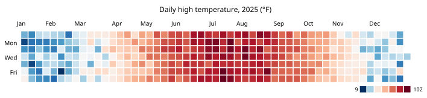

# calendar-heatmap

GitHub-style calendar heatmap, rendered as a matplotlib figure or a
self-contained, hoverable SVG.




## Install

```bash
pip install calendar-heatmap
```

## Usage

```python
from datetime import date
import matplotlib.pyplot as plt
from calendar_heatmap import CalendarHeatmap

data = {
    date(2026, 1, 3): 4,
    date(2026, 1, 4): 1,
    date(2026, 2, 14): 9,
}

heatmap = CalendarHeatmap(data)

ax = heatmap.plot(title="Activity in the last year")
plt.show()
```

`data` maps each active date to a numeric value (e.g. a commit count); dates
missing from `data` are treated as zero. Anything with a `.to_dict()` method,
such as a pandas `Series` indexed by date, works too.

`CalendarHeatmap(data, ...)` computes the calendar window and color buckets
once; call `.plot()` and/or `.to_svg()` on it as many times as you like to
render that same data in either form.

### `.plot()` — matplotlib

```python
ax = heatmap.plot(ax=None, title="Activity in the last year")
```

Draws onto a matplotlib `Axes` and returns it, so it composes with the rest
of the matplotlib API — pass `ax=` to draw into an existing figure/subplot,
save the figure with `ax.figure.savefig(...)`, etc.

- `ax` — Axes to draw onto. A new figure/Axes is created if omitted.
- `show_legend`, `legend_labels` — control the "Less → More" legend.
- `title` — optional title above the calendar.
- `font_family` — font (or ordered fallback list) for the title, tick labels,
  and legend text. See
  [`examples/generate_example.py`](examples/generate_example.py) for an
  example that matches GitHub's own UI font stack.

### `.to_svg()` — interactive SVG

```python
svg = heatmap.to_svg(title="Activity in the last year", path="heatmap.svg")
```

Renders a self-contained SVG string with a native `<title>` tooltip on every
cell and a CSS `:hover` highlight — meant to be embedded directly in an HTML
page (not via ``, which sandboxes the SVG from the page's CSS entirely,
disabling both). This only works in a plain HTML page you control: GitHub's
own README/markdown renderer strips `<svg>` and all its child tags outright
(they aren't on its sanitizer's allowlist at all), so it can't be embedded
inline in a README — save it to a file and open it directly in a browser
instead.

- `show_legend`, `legend_labels`, `title` — same as `.plot()`.
- `font_family` — CSS `font-family` value for the SVG's text (default
  `"sans-serif"`).
- `label_color` — CSS color for the month/day-of-week labels and legend text.
- `tooltip_fn` — a `(date, value) -> str` callable producing each cell's
  tooltip text. Defaults to `"{value} on {date}"`.
- `path` — if given, also writes the SVG markup to this file path.

### Shared options (constructor)

- `start`, `end` — bound the calendar window explicitly (defaults to the
  `weeks` weeks before `end`, snapped back to the preceding Sunday).
- `weeks` — width of the default window, in weeks (default `53`).
- `colors` — sequence of fill colors for increasing activity buckets, low to
  high (default: GitHub's green ramp). Ignored if `cmap` is given.
- `zero_color` — fill color for zero/missing days. Ignored if `cmap` is
  given — the "zero means no activity" bucket model doesn't fit continuous
  data with no natural zero, like temperature.
- `cmap` — a matplotlib colormap (name or `Colormap`) for continuous data.
  Enables continuous coloring instead of the `colors`/`zero_color` buckets:
  every value maps to a color via this colormap, rather than being bucketed.
  Pass a diverging colormap (e.g. `"RdBu_r"`) with `vcenter` set to a
  meaningful midpoint to get a true divergent gradient.
- `vmin`, `vmax` — data range for `cmap`. Default to the min/max of the
  data's values.
- `vcenter` — if given (with `cmap`), colors diverge from this value (e.g.
  `vcenter=32` for Fahrenheit's freezing point) instead of scaling linearly
  end to end.

## Development

```bash
pip install -e ".[test]"
pytest
```
