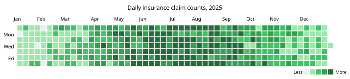

# calendar-heatmap

GitHub-style calendar heatmap, rendered as a matplotlib figure or a
self-contained, hoverable SVG.



*Synthetic daily insurance claim counts for a year — claims trend higher in
summer and lower in the colder months. Generated by
[`examples/generate_example.py`](examples/generate_example.py), which also
writes an
[interactive version](examples/claims_heatmap_interactive.svg) of the same
chart — open it directly in a browser to hover a day and see its claim count.*

## Install

```bash
pip install calendar-heatmap
```

## Usage

```python
from datetime import date
import matplotlib.pyplot as plt
from calendar_heatmap import CalendarHeatmap

data = {
    date(2026, 1, 3): 4,
    date(2026, 1, 4): 1,
    date(2026, 2, 14): 9,
}

heatmap = CalendarHeatmap(data)

ax = heatmap.plot(title="Activity in the last year")
plt.show()
```

`data` maps each active date to a numeric value (e.g. a commit count); dates
missing from `data` are treated as zero. Anything with a `.to_dict()` method,
such as a pandas `Series` indexed by date, works too.

`CalendarHeatmap(data, ...)` computes the calendar window and color buckets
once; call `.plot()` and/or `.to_svg()` on it as many times as you like to
render that same data in either form.

### `.plot()` — matplotlib

```python
ax = heatmap.plot(ax=None, title="Activity in the last year")
```

Draws onto a matplotlib `Axes` and returns it, so it composes with the rest
of the matplotlib API — pass `ax=` to draw into an existing figure/subplot,
save the figure with `ax.figure.savefig(...)`, etc.

- `ax` — Axes to draw onto. A new figure/Axes is created if omitted.
- `show_legend`, `legend_labels` — control the "Less → More" legend.
- `title` — optional title above the calendar.
- `font_family` — font (or ordered fallback list) for the title, tick labels,
  and legend text. See
  [`examples/generate_example.py`](examples/generate_example.py) for an
  example that matches GitHub's own UI font stack.

### `.to_svg()` — interactive SVG

```python
svg = heatmap.to_svg(title="Activity in the last year", path="heatmap.svg")
```

Renders a self-contained SVG string with a native `<title>` tooltip on every
cell and a CSS `:hover` highlight — meant to be embedded directly in an HTML
page (not via ``, which sandboxes the SVG from the page's CSS entirely).
GitHub's own README/markdown renderer strips `<style>` tags, so the hover
highlight and font only apply outside of GitHub's markdown sanitizer; the
`<title>` tooltip itself is unaffected.

- `show_legend`, `legend_labels`, `title` — same as `.plot()`.
- `font_family` — CSS `font-family` value for the SVG's text (default
  `"sans-serif"`).
- `label_color` — CSS color for the month/day-of-week labels and legend text.
- `tooltip_fn` — a `(date, value) -> str` callable producing each cell's
  tooltip text. Defaults to `"{value} on {date}"`.
- `path` — if given, also writes the SVG markup to this file path.

### Shared options (constructor)

- `start`, `end` — bound the calendar window explicitly (defaults to the
  `weeks` weeks before `end`, snapped back to the preceding Sunday).
- `weeks` — width of the default window, in weeks (default `53`).
- `colors` — sequence of fill colors for increasing activity buckets, low to
  high (default: GitHub's green ramp).
- `zero_color` — fill color for zero/missing days.

## Development

```bash
pip install -e ".[test]"
pytest
```
